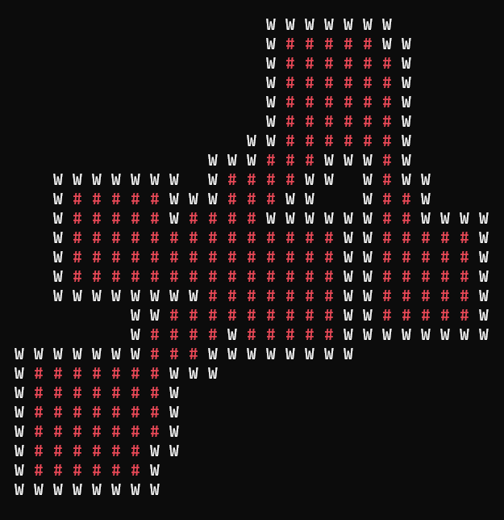

<!-- markdownlint-configure-file {
  "MD013": {
    "code_blocks": false,
    "tables": false
  },
  "MD033": false,
  "MD041": false
} -->

<div align="center">

# Grid Dungeon Generator


A simple grid based dungeon generator for games. Still in progress.

</div>

<p align="center">
  
</p>

### How works

1. Create a DungeonArgs using the DungeonArgsBuilder

```cs
  DungeonArgsBuilder builder = new DungeonArgsBuilder();
  // Quantity or room to generate
  builder.RoomsQuantity(5);
  // Minimum room size
  builder.RoomMinSize(5);
  // Maximum room size
  builder.RoomMaxSize(10);
  // Dungeon width
  builder.DungeonSizeX(50);
  // Dungeon height
  builder.DungeonSizeY(50);
```

2. Create a DungeonGenerator object
   
```cs
  DungeonGenerator dungeonGenerator = new DungeonGenerator();
```

3. Call Generate method passing the dungeon args
   
```cs
  Dungeon dungeon = dungeonGenerator.Generate(builder.Build);
```

### Classes

#### Dungeon

| Properties      | Description                           |
| --------------- | ------------------------------------- |
| Grid            | Grid of `Square`                      |

#### Square

| Properties      | Description                                   |
| --------------- | --------------------------------------------- |
| X               | Row where the square is positioned            |
| Y               | Row where the square is positioned            |
| IsWall          | Property that defines if the square is a wall |
| RoomPart        | Property that defines if the square is floor  |
  
